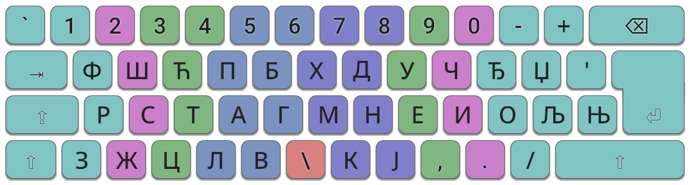
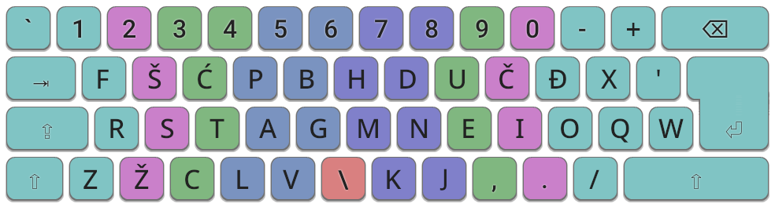
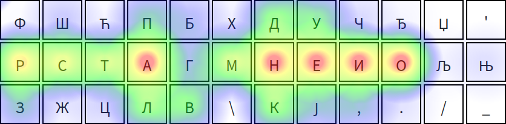
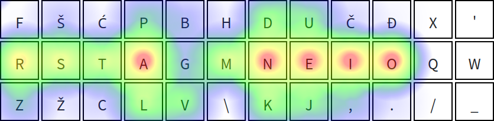

## Colemak Mod-DH (Bosnian, Croatian, Serbian)
A variant of [Colemak Mod-DH ISO](https://github.com/ColemakMods/mod-dh) for Bosnian/Croatian/Serbian. Available in Cyrillic and Latin.

    
     
    

***

<em>Heatmap with an excerpt from </em>Na Drini ćuprija<em></em>

    
     
    

### Description
Features a rearranged Colemak Mod-DH layout for more comfortable typing in these languages. Changes and features conform to Colemak’s philosophy:

- Characters have been moved in accordance with Bosnian/Croatian/Serbian letter patterns.
  - Common digraphs and trigraphs are now easier to type: *je*, *ra*, *da*, *sam*, *šta*, *ali*.
  - The first 4 home row characters have been changed from *ARST* to *RSTA*. The letter A is more common than the other three and therefore merits index finger use.
- Rare characters are placed further away. This includes letters from the English alphabet (Q, W, X).
- Punctuation marks are mostly positioned the same as in Colemak Mod-DH. (This placement is arguably more ergonomic compared to European QWERTY positions.)
- Third (AltGr) and fourth (Shift + AltGr) character layers are mostly preserved from the original QWERTY layout.

The Bosnian (Latin), Croatian and Serbian (Latin) layouts are the same functionally. The same applies to Bosnian (Cyrillic) and Serbian (Cyrillic).

### Download

**Windows**: See instructions in the [klc](klc) folder.

**Linux**: See instructions in the [xkb](xkb) folder.

### Known problems
- The digraph *nj* isn't very comfortable to type. *ije*, one of the most common trigraphs, could also be optimized; it currently requires the ring-index-middle fingers, in that order.
- [Cyrillic] Љ and Њ are positioned rather far away. A good solution would be to automatically turn the digraphs *лј*/*нј* into *љ*/*њ* respectively. This may be possible on Windows with [AutoHotkey](https://www.autohotkey.com/), but it is [**not yet possible**](https://github.com/autokey/autokey/issues/114) on Linux with [AutoKey](https://github.com/autokey/autokey).
- [Latin] The letter Y is not yet in the Latin layout, as a suitable position has not yet been found.

### Resources used when making
- [Online Tools - Calculate letter frequencies](https://onlinetoolz.net/letter-frequency)
- [Ortho Heat](https://oha-ohashi.github.io/2022_1/a_ortho/ortho_heat.html)

### External links
- [Topic on Colemak forum](https://forum.colemak.com/topic/2996-cyrilliclatin-colemak-for-boshrvmnesrb/)
- [Topic on Srpski jezički atelje](https://forum.srpskijezickiatelje.com/index.php?topic=6315.0)
