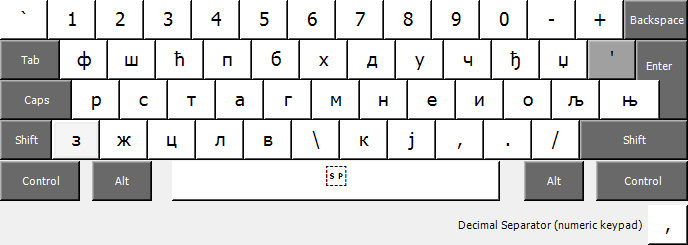
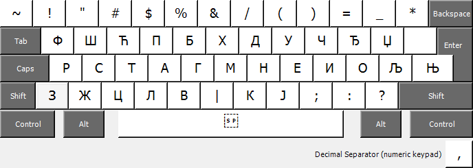
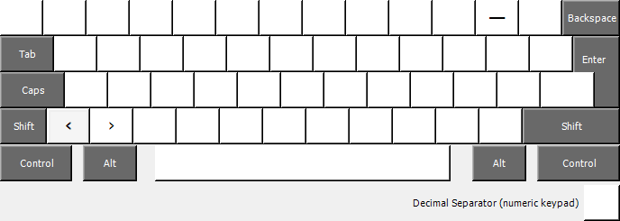
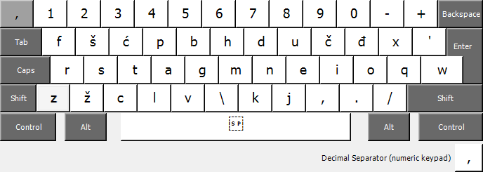
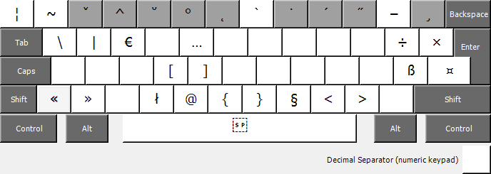

## Colemak Mod-DH (Bosnian, Croatian, Serbian) for Windows

**Quick start:** Pre-generated installer files are available in the .zip packages listed below.

### Create custom installer

Microsoft has created a tool called [Keyboard Layout Creator](https://www.microsoft.com/en-us/download/details.aspx?id=102134 "MS Keyboard Layout Creator") (MSKLC) which allows users to generate their own installable keyboard layout definitions.

You can use Keyboard Layout Creator to customize your layout in the downloads below. To use one of these KLC files, load it into MSKLC, make your edits, and use the menu option *Project > Build DLL and Setup Package* to generate the installer.

## Cyrillic layout

**Bosnian**

- [Download KLC](colemak_dh_bs-cyrl.klc?raw=true)
- [Download zip](colemak_dh_bs-cyrl.zip?raw=true)

**Serbian**

- [Download KLC](colemak_dh_sr-cyrl.klc?raw=true)
- [Download zip](colemak_dh_sr-cyrl.zip?raw=true)

### Standard layer

### Shift

### Alt + Ctrl (AltGr)

### Ctrl

## Latin layout

**Bosnian**

- [Download KLC](colemak_dh_bs-latn.klc?raw=true)
- [Download zip](colemak_dh_bs-latn.zip?raw=true)

**Croatian**

- [Download KLC](colemak_dh_hr.klc?raw=true)
- [Download zip](colemak_dh_hr.zip?raw=true)

**Serbian**

- [Download KLC](colemak_dh_sr-latn.klc?raw=true)
- [Download zip](colemak_dh_sr-latn.zip?raw=true)

### Standard layer

### Shift

### Alt + Ctrl (AltGr)

### Ctrl

