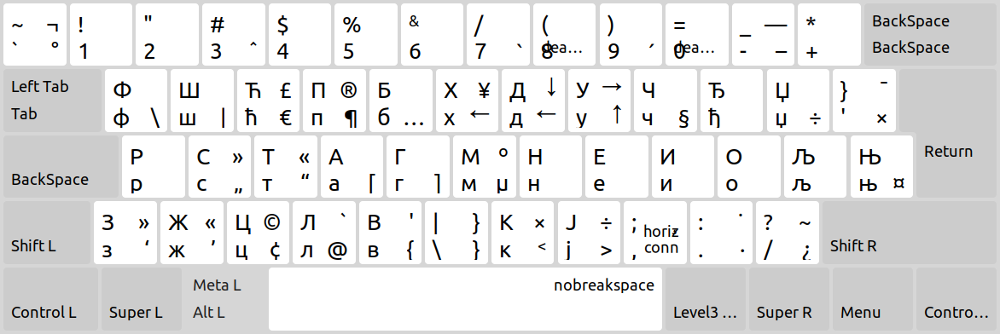
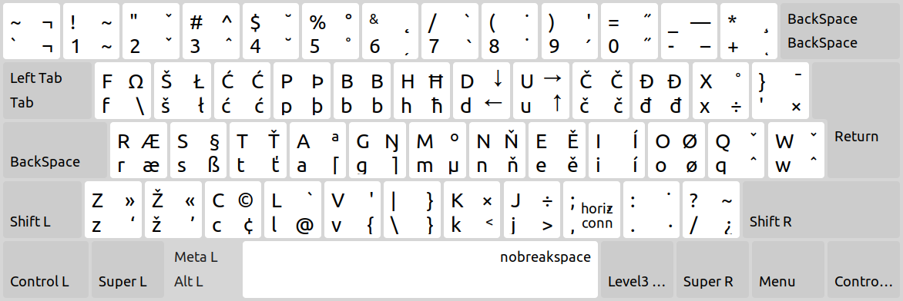

## Colemak Mod-DH (Bosnian, Croatian, Serbian) for Linux

### Cyrillic layout



### Latin layout



## Instructions

1. Download the file for your respective locale:
    - [ba_colemak](ba_colemak)  (Bosnian)
    - [hr_colemak](hr_colemak)  (Croatian)
    - [rs_colemak](rs_colemak)  (Serbian)

  ##### The following steps will require root access.

2. Move the downloaded file to ```/usr/share/X11/xkb/symbols/```.
3. Open ```/usr/share/X11/xkb/rules/evdev.lst``` in your text editor of choice.</br>*Back up the file in case something goes unexpectedly.*
4. At the end of the ```! model``` section, append the layout:
   ```
     ##_colemak      %%% (Colemak-DH)
   ```
   *Replace *##* with your file name and *%%%* with your language name (Bosnian/Croatian/Serbian).*
5. Save your text changes.
6. Open ```/usr/share/X11/xkb/rules/evdev.xml``` in your text editor of choice.</br>*Back up the file in case something goes unexpectedly.*
7. Find your language add make a new ```<layout>``` below it. Example:

    ```xml
    <layout>
      <configItem>
        <name>ba_colemak</name>
        <shortDescription>bs</shortDescription>
	      <description>Bosnian (Colemak-DH)</description>
        <languageList><iso639Id>bos</iso639Id></languageList>
      </configItem>
      <variantList>
        <variant>
          <configItem>
            <name>colemak_dh_cyr</name>
            <description>Bosnian (Cyrillic, Colemak-DH)</description>
          </configItem>
        </variant>
        <variant>
          <configItem>
            <name>colemak_dh_lat</name>
            <description>Bosnian (Latin, Colemak-DH)</description>
          </configItem>
        </variant>
      </variantList>
    </layout>
8. Save your text changes.
9. Set your newly added keyboard layout in your keyboard application.
